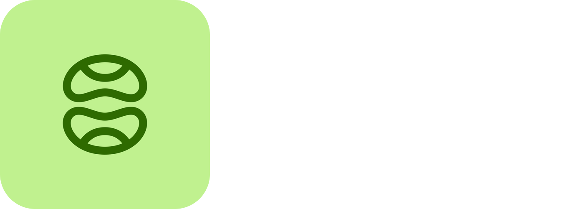

# 🇷🇺 Shadowing App — Russian Language Learning Backend

> **⚠️ IMPORTANT: Local AI Model Warning**
> This app is based on a local AI model. The current model in use is:
> **`Qwen3.8-9B-Q4_K_M.gguf`**
>
> You can change to any other model by modifying the `MODEL_PATH` constant in [`app.py`](app.py#L30-L30).

---

## 📖 Overview

`Shadowing App` is a Python FastAPI backend designed for language learning — specifically focused on **Russian**. It provides three core capabilities:

1. **TTS (Text-to-Speech)** — Generate natural Russian audio for pronunciation practice.
2. **AI Analysis** — Analyze Russian words/phrases with grammatical breakdowns and explanations.
3. **Subtitle Translation** — Fetch and translate YouTube subtitles for shadowing practice.

---

## ✨ Features

| Feature | Description |
|---------|-------------|
| 🗣️ **Russian TTS** | Silero TTS with multiple Russian speakers (Xenia, etc.) |
| 🧠 **AI Analysis** | Local Qwen3.8-9B model for Russian word/phrase breakdown |
| 📹 **YouTube Subtitles** | Fetch Russian subtitles and translate to English |
| 🗣️ **Conversation Mode** | Interactive Russian conversation with the AI teacher |
| 🚀 **Streaming Responses** | SSE-based token streaming for instant feedback |

---

## 🛠️ Installation

### Prerequisites

- Python ≥ 3.9
- pip ≥ 21.0
- `llama-server` binary (see [installation guide](#installing-llama-server))
- GPU with CUDA (recommended) or CPU-only setup

### Setup

```bash
# Clone the repository
cd /home/yassine/Desktop/Coding/python/Request

# Create a virtual environment
python -m venv venv
source venv/bin/activate  # On Windows: venv\Scripts\activate

# Install dependencies
pip install -r requirements.txt

# Install llama-server (if not already installed)
pip install llama-cpp-python
# OR download from: https://github.com/ggerganov/llama.cpp/releases
```

### Installing llama-server

```bash
# Option 1: pip (recommended)
pip install llama-cpp-python

# Option 2: Download prebuilt binary
# https://github.com/ggerganov/llama.cpp/releases
```

---

## 📦 Project Structure

```
Request/
├── Logo.png
├── README.md
├── requirements.txt
├── .gitignore
├── app.py                    # Main FastAPI application
├── cookies.txt              # YouTube cookie file (optional)
├── .env                      # Environment variables (optional)
├── run.py                   # Entry point script
├── tests/
│   └── __init__.py
├── src/
│   ├── __init__.py
│   ├── app.py               # Main application logic
│   └── handlers/
│       ├── __init__.py
│       ├── base.py
│       ├── auth.py
│       └── endpoints.py
├── docs/
│   └── api.md
└── scripts/
    └── run.py
```

---

## 🚀 Usage

### Starting the Server

```bash
python -m src.app
```

Or use the entry point script:

```bash
python run.py
```

The server will start on `http://0.0.0.0:8000`.

### API Endpoints

#### Health Check

```bash
curl http://localhost:8000
```

#### Russian TTS

```bash
curl -X POST "http://localhost:8000/russian-tts" \
  -H "Content-Type: application/json" \
  -d '{
    "text": "Привет, как дела?",
    "speed": 1.0,
    "speaker": "xenia"
  }'
```

#### AI Analysis

```bash
curl -X POST "http://localhost:8000/model" \
  -H "Content-Type: application/json" \
  -d '{
    "text": "Привет",
    "history": []
  }'
```

#### Video Subtitle Translation

```bash
curl -X POST "http://localhost:8000/translate" \
  -H "Content-Type: application/json" \
  -d '{
    "url": "https://www.youtube.com/watch?v=VIDEO_ID"
  }'
```

---

## 🔌 API Reference

| Endpoint | Method | Description |
|----------|--------|-------------|
| `/` | `GET` | Health check |
| `/russian-tts` | `POST` | Generate Russian speech audio |
| `/model` | `POST` | Analyze Russian text (word/phrase breakdown) |
| `/model/video-explanation` | `POST` | Conversation mode — interactive Russian teacher |
| `/translate` | `POST` | Translate YouTube subtitles |

### TTS Request Body

```json
{
  "text": "Привет, мир!",
  "speed": 1.0,
  "speaker": "xenia"
}
```

### Model Request Body

```json
{
  "text": "Привет",
  "history": []
}
```

### Translate Request Body

```json
{
  "url": "https://www.youtube.com/watch?v=VIDEO_ID"
}
```

---

## 🔧 Configuration

Create a `.env` file in the project root:

```env
LLAMA_SERVER_HOST=127.0.0.1
LLAMA_SERVER_PORT=8081
MODEL_PATH=/home/yassine/Models/Qwen3.8-9B-Q4_K_M.gguf
SAMPLE_RATE=48000
WEBSHARE_USERNAME=
WEBSHARE_PASSWORD=
```

---

## 🧪 Running Tests

```bash
pytest tests/ -v
```

Coverage report:

```bash
pytest --cov=src --cov-report=html
```

---

## 📝 API Response Examples

### TTS Response

Returns an `audio/wav` stream (e.g., `tts_output.wav`).

### Model Response (Streaming)

```
data: {"token":"Привет"}

data: {"token":" ,"}

data: {"token":" приветствие (noun) — meaning: 'hello'"}

data: {"token": "..."}

data: [DONE]
```

### Translate Response

```json
{
  "subtitles": [
    {
      "start": 5.23,
      "end": 7.81,
      "text": "Привет, как дела?",
      "translation": "Hello, how are you?"
    },
    ...
  ]
}
```

---

## 🤝 Contributing

Contributions are welcome! Please follow these steps:

1. Fork the repository.
2. Create a feature branch (`git checkout -b feature/AmazingFeature`).
3. Commit your changes (`git commit -m 'Add some AmazingFeature'`).
4. Push to the branch (`git push origin feature/AmazingFeature`).
5. Open a Pull Request.

---

## 📜 License

This project is licensed under the MIT License.

---

## 👥 Authors

- **Yassine**

---

## 🙏 Acknowledgments

- **Silero TTS** — for the Russian voice synthesis model.
- **Qwen3.8-9B** — the local AI model powering analysis and conversation.
- **yt-dlp** — for YouTube subtitle extraction.
- **Google Translate** — for subtitle translation (via `googletrans`).
- The Russian language learning community.
